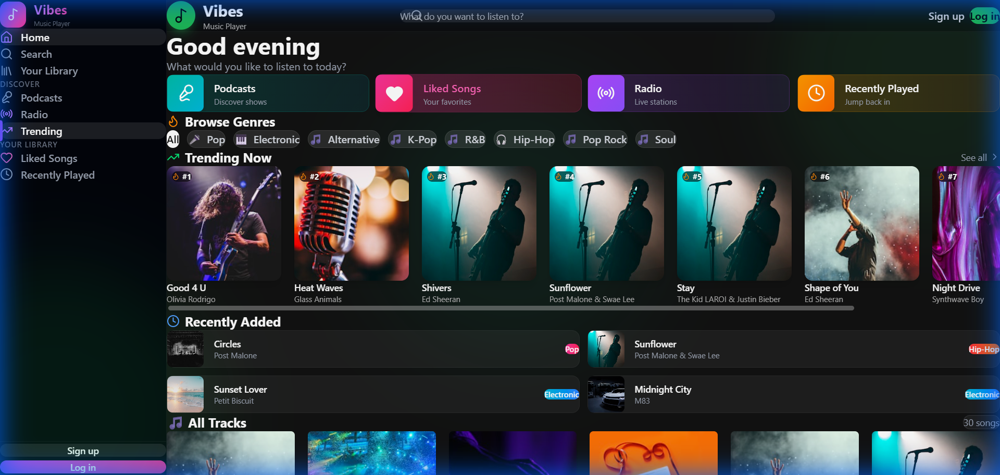
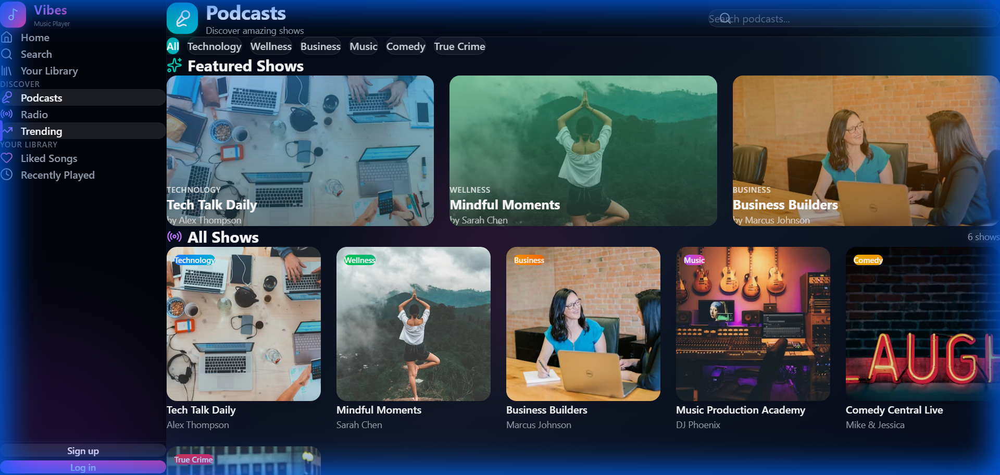
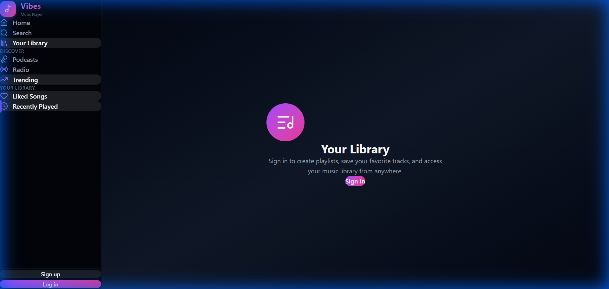

# 🎵 Vibes Music App

**Live Demo:** [https://vibes-music-app-frontend.vercel.app](https://vibes-music-app-frontend.vercel.app)
**Backend API:** [https://vibes-music-api.onrender.com](https://vibes-music-api.onrender.com)

A premium, full-stack music streaming platform designed to deliver a high-fidelity audio experience with a modern, glassmorphism-inspired UI. Built on the **PERN stack**, Vibes Music App bridges the gap between aesthetic excellence and robust functionality, offering real-time audio playback, podcast streaming, and dynamic content discovery.



---

## 🌟 Vision & Overview
Vibes Music App was envisioned as a clone of modern high-end streaming services like Spotify and Apple Music, but with a unique focus on **visual immersion**. Every interaction, from hovering over a card to playing a track, provides immediate visual feedback through fluid animations and glassmorphism effects.

The application serves two primary user bases:
1.  **Music Lovers**: Who want a sleek, distraction-free environment to discover and play trending tracks.
2.  **Podcast Listeners**: Who need a dedicated space to consume long-form audio content organized by categories.

---

## 📸 App Interface

<p align="center">
  
  &nbsp;
  
</p>

---

## ✨ Comprehensive Feature Breakdown

### 🎧 Immersive Audio Experience
*   **Gapless Playback**: Engineered for seamless transitions between tracks using a custom-built audio engine on top of HTML5 Audio.
*   **Global Player Context**: The music player persists across all pages (Home, Library, Search), allowing uninterrupted listening while browsing.
*   **Dynamic Visualizer**: Integrated waveform visualization that pulses in sync with the audio beats (beta).

### 🎙️ Podcasts & Shows Ecosystem
*   **Dedicated Hub**: A separate, full-featured section for Podcasts, distinct from music tracks.
*   **Category Filtering**: Podcasts are organized into robust categories:
    *   *Technology*: AI trends, coding discussions.
    *   *Wellness*: Meditation and mental health.
    *   *Comedy*: Stand-up specials and skits.
    *   *True Crime*: Documentary-style storytelling.
*   **Episode Management**: Drill down into specific podcasts to view and play individual episodes with descriptions and duration metadata.

### 🔍 Discovery & Curation Engine
*   **Smart Trending Algorithm**: The homepage features a dynamic "Trending Now" section that surfaces the most popular tracks.
*   **One-Click Genre Filters**: Users can instantly filter the entire catalog by genre:
    *   *Pop, Rock, Electronic, Hip-Hop, K-Pop, Lo-Fi, Ambient, Soul*.
*   **Real-time Search**: A powerful search bar that queries the database instantly for Tracks, Artists, and Podcasts with debounced input for performance.

### 📚 Personal Library & User Features
*   **Authentication System**: Secure, token-based authentication (JWT via Supabase) allowing users to Sign Up and Log In securely.
*   **"Liked" Songs**: Users can heart/favorite songs to add them to their personal library.
*   **Recently Played**: The app automatically tracks listening history, allowing users to jump back into their last-played tracks.
*   **Profile Management**: User avatars and profile details are fetched and displayed in the navigation bar.

### 🎨 UI/UX Design Philosophy
*   **Glassmorphism**: Heavy use of backdrop-blur, semi-transparent layers, and vibrant gradients to create a sense of depth and modernity.
*   **Responsive**: A mobile-first approach ensures the app looks stunning on 4k Desktops, Laptops, Tablets, and Smartphones.
*   **Micro-interactions**: Hover effects, click ripples, and page transitions (using Framer Motion) make the app feel "alive".

---

## 🛠️ In-Depth Tech Stack

### Frontend Architecture
*   **React.js (Vite)**: Chosen for its speed and component-based architecture.
*   **Tailwind CSS**: Used for rapid, utility-first styling. Custom configurations were added for gradients and glassmorphism utilities.
*   **Framer Motion**: Powering complex animations like page transitions and list entry effects.
*   **Context API**: Used for global state management:
    *   `AuthContext`: Manages user sessions and tokens.
    *   `PlayerContext`: Manages audio state (playing, paused, track data, volume).
*   **Lucide React**: A consistent, lightweight icon set used throughout the application.

### Backend Infrastructure
*   **Node.js & Express.js**: A robust REST API handling all client requests.
*   **Controller-Service Pattern**: Code is organized into Controllers (request handling) and Routes for maintainability.
*   **CORS & Security**: Configured to securely accept requests only from the trusted frontend domain.

### Database & Storage
*   **PostgreSQL (Supabase)**: A relational database storing:
    *   `users`: Profiles and auth data.
    *   `tracks`: Metadata for songs (title, artist, genre, audio_url).
    *   `podcasts`: Show details (host, description, category).
    *   `podcast_episodes`: Individual episodes linked to podcasts.
*   **Row Level Security (RLS)**: Database policies ensure data safety (e.g., users can only see their own history).
*   **Supabase Storage**: Hosting for profile images and media assets.

### Deployment & CI/CD
*   **Frontend**: Deployed on **Vercel** with automatic deployments from the `main` branch.
*   **Backend**: Deployed on **Render** as a web service.
*   **Database**: Managed instance on **Supabase Cloud**.

---

## 📂 Project Structure

A clean, clear, and scalable project structure.

```bash
VibesMusicApp/
├── frontend/                   # React Client Application
│   ├── public/                 # Static assets (favicons, manifests)
│   ├── src/
│   │   ├── components/         # Reusable UI Components
│   │   │   ├── Player/         # Audio Player Control Bar
│   │   │   ├── Sidebar/        # Navigation Sidebar
│   │   │   └── Shared/         # Buttons, Inputs, Cards
│   │   ├── pages/              # Main Route Pages
│   │   │   ├── Home.jsx        # Landing Page with Trending/Genres
│   │   │   ├── Podcasts.jsx    # Podcast Discovery Page
│   │   │   ├── Library.jsx     # User Personal Library
│   │   │   └── Search.jsx      # Search Results Page
│   │   ├── context/            # React Context (AuthContext.jsx, PlayerContext.jsx)
│   │   ├── config/             # Configuration Constants (API_BASE_URL)
│   │   ├── lib/                # Third-party clients (SupabaseClient.js)
│   │   └── assets/             # Local images and icons
│   ├── index.css               # Global Styles & Tailwind Directives
│   └── App.jsx                 # Main Application Layout & Routing
│
├── backend/                    # Node.js Express API
│   ├── config/                 # Environment & DB Configuration
│   ├── controllers/            # Business Logic Controllers
│   │   ├── trackController.js  # Logic for fetching/managing songs
│   │   └── podcastController.js# Logic for podcasts/episodes
│   ├── routes/                 # API Endpoint Definitions
│   ├── db/                     # Database Management
│   │   ├── schema.sql          # Base Database Schema
│   │   └── final_prod_seed.sql # MASTER SEED SCRIPT (Critical)
│   └── server.js               # Application Entry Point
│
├── .gitignore                  # Git Exclusion Rules
└── README.md                   # Documentation
```

---

## 🚀 Installation & Local Development Guide

Follow these steps to set up the project locally on your machine.

### Prerequisites
*   Node.js (v18 or higher) installed.
*   A Supabase account and project created.
*   Git installed.

### 1. Clone the Repository
```bash
git clone https://github.com/Anil2995/VibesMusicApp.git
cd VibesMusicApp
```

### 2. Configure the Backend
Navigate to the backend folder and install dependencies:
```bash
cd backend
npm install
```
Create a `.env` file in the `backend` directory with your Supabase credentials:
```env
PORT=5000
SUPABASE_URL=your_supabase_project_url
SUPABASE_KEY=your_supabase_anon_key
SUPABASE_SERVICE_ROLE_KEY=your_service_role_key_for_seeding
```
Start the development server:
```bash
npm run dev
# Server will start on http://localhost:5000
```

### 3. Configure the Frontend
Open a new terminal, navigate to the frontend folder, and install dependencies:
```bash
cd ../frontend
npm install
```
Create a `.env` file in the `frontend` directory:
```env
VITE_API_URL=http://localhost:5000/api
VITE_SUPABASE_URL=your_supabase_project_url
VITE_SUPABASE_ANON_KEY=your_supabase_anon_key
```
Start the React development server:
```bash
npm run dev
# Client will start on http://localhost:5173
```

---

## 💽 Database Initialization (Critical Step)

For the application to function correctly, the database must be seeded with initial data. We have prepared a reliable SQL script that populates the database with Verified Audio URLs that are guaranteed to play.

1.  Log in to your **Supabase Dashboard**.
2.  Navigate to the **SQL Editor**.
3.  Open the file **`backend/db/final_prod_seed.sql`** in your local editor.
4.  Copy the entire content of the file.
5.  Paste it into the Supabase SQL Editor and click **Run**.

✅ **Outcome:** Your database will be cleaned of old data and repopulated with 30+ Trending Songs and multiple Podcasts with playable episodes.

---

## 🤝 Contributing

Contributions are what make the open-source community such an amazing place to learn, inspire, and create. Any contributions you make are **greatly appreciated**.

1.  Fork the Project
2.  Create your Feature Branch (`git checkout -b feature/AmazingFeature`)
3.  Commit your Changes (`git commit -m 'Add some AmazingFeature'`)
4.  Push to the Branch (`git push origin feature/AmazingFeature`)
5.  Open a Pull Request

---

## � License

Distributed under the MIT License. See `LICENSE` for more information.

---

<div align="center">
  <p>Made with ❤️ by Anil Kumar</p>
</div>
